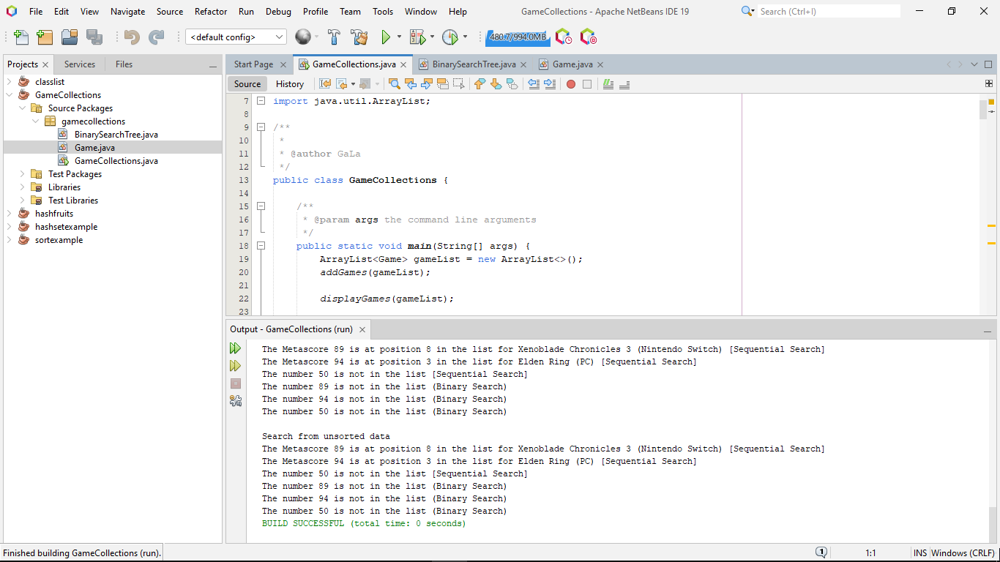
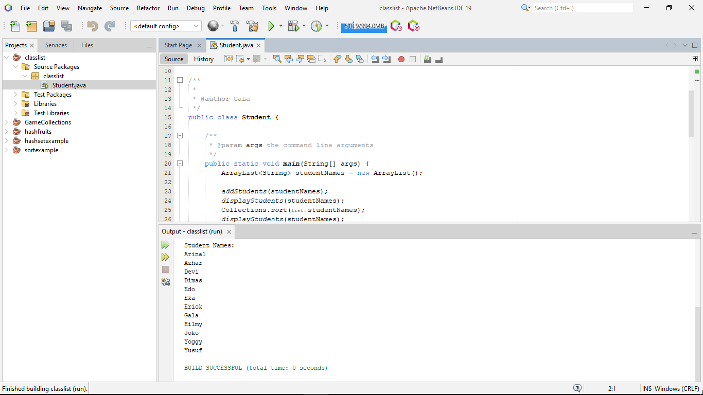
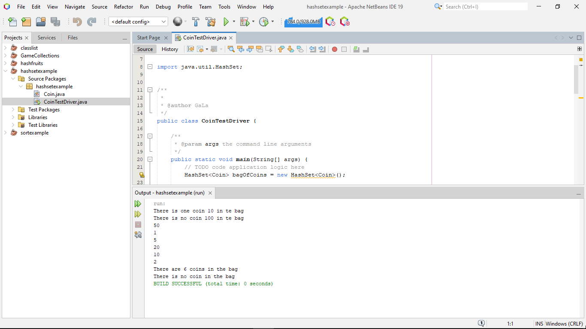
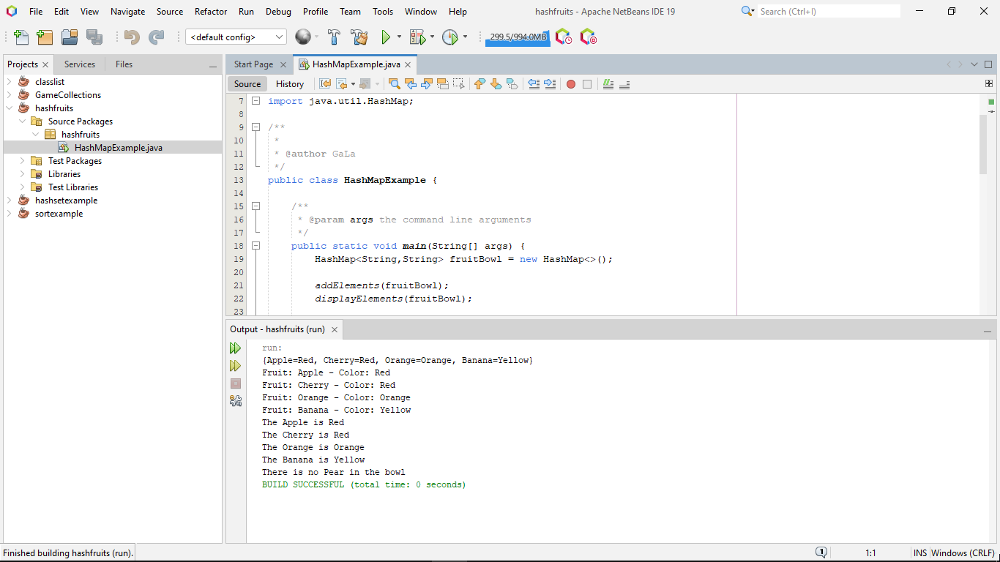
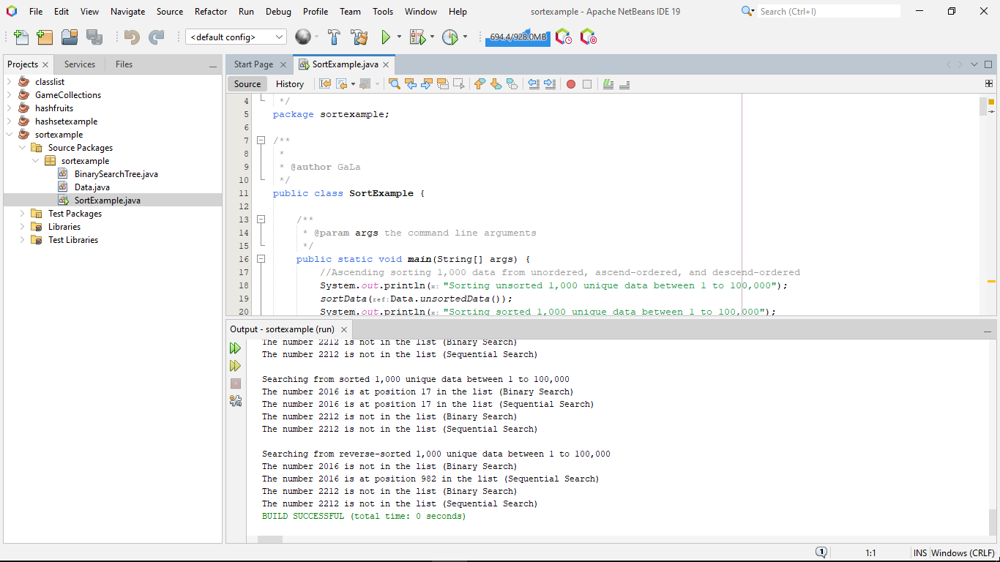

<!-- JAVA COLLECTIONS -->
 

  

  <h3 align="center">JavaCollections</h3>

  

    A compilation of projects to learn object-oriented programming in Java focus on Java Collections (manipulating data)

<!-- TABLE OF CONTENTS -->

  
Table of Contents

  <ol>
    <li>
      <a href="#about-JavaCollections">About JavaCollections</a>
      <ul>
        <li><a href="#variants">Variants</a></li>
        <li><a href="#built-with">Built With</a></li>
      </ul>
    </li>
    <li>
      <a href="#getting-started">Getting Started</a>
      <ul>
        <li><a href="#prerequisites">Prerequisites</a></li>
        <li><a href="#installation">Installation</a></li>
      </ul>
    </li>
    <li><a href="#usage">Usage</a></li>
    <li><a href="future-development">Future Development</a></li>
    <li><a href="#license">License</a></li>
    <li><a href="#contact">Contact</a></li>
    <li><a href="#acknowledgments">Acknowledgments</a></li>
  </ol>

<!-- ABOUT JavaCollections -->
## About JavaCollections

JavaCollections is a compilation of projects to learn object-oriented programming in Java focus on Java Collections (manipulating data). 

Its inspiration comes from Java Programming course by Oracle Academy.

(<a href="#readme-top">back to top</a>)

### Variants

There are 5 projects in JavaCollections Project:
+ classlist
+ hashsetexample
+ hashfruits
+ sortexample
+ GameCollections

`classlist`
`hashsetexample`
`hashfruits`
`sortexample` are inspired by example and tasks in JP course. 

`classlist` stores and sorts student names _(String)_ in a list using `ArrayList`.  `hashsetexample` stores and find coin _(Coin class)_ in a bag using `HashSet`. `hashfruits` stores and find fruits _(String)_ and their colors _(String)_ in a fruit bowl using `HashMap`.

`sortexample` is a project manipulating data in `int[]` structure. `sortexample` sorts and finds a value in 100 data and 1,000 data integer arrays. Each integer array has unsorted, ascending sorted, and descending sorted version. `sortexample` features time processing on each sorting algorithm for time comparison.

`GameCollections` is a project manipulating data in `ArrayList` with a specific class. The data is a list of games in `ArrayList` of Game class. Each game has name, platform, and metascore. Some games have same metascore. `GameCollections` sorts and finds a value of Metascore in a game list by lower value (ascending).

`GameCollections``sortexample` both have same types of sorting and searching algorithms. The sorting algorithm are _Selection Sort_, _Bubble Sort_, _Optimized Bubble Sort_, and _Binary Search Tree_ (using class specific). The searching algorithm are _Binary Search_ and _Sequential Search_.

(<a href="#readme-top">back to top</a>)

### Built With

Each built is a standalone project using Java with Ant.

(<a href="#readme-top">back to top</a>)

<!-- GETTING STARTED -->
## Getting Started

This is an example of how to use JavaCollections project on Apache NetBeans 19.

### Prerequisites

* Apache NetBeans 19 with JDK 17 installed

_You can find the latest version of Apache NetBeans <a href="https://netbeans.apache.org/download/index.html">here</a>._

### Installation
1. Download <a href="https://github.com/satriamjati/JavaCollections/archive/refs/heads/main.zip">JavaCollections</a> source code
2. Extract JavaCollections zip to your chosen folder
1. Open Apache NetBeans 19
2. Open File > Open Project... (CTRL+Shift+O)
3. Find your folder at step 2
4. Choose a variant you want to try
7. Click Open Project
8. Project ready

(<a href="#readme-top">back to top</a>)

<!-- USAGE EXAMPLES -->
## Usage

You can run every JavaCollections variants to have a good summary of how manipulating data in Java. Each description is listed in <a href="#variant">Variant</a>. 

Furthermore, you can create your own modification to answer your curiousity.

(<a href="#readme-top">back to top</a>)

<!-- FUTURE DEVELOPMENT -->
## Future Development

Hopefully, find the best practices of data manipulating. Also, add new variant of sorting and searching algorithm for comparison.

(<a href="#readme-top">back to top</a>)

<!-- LICENSE -->
## License

Distributed under the MIT License. See `LICENSE.txt` for more information.

(<a href="#readme-top">back to top</a>)

<!-- CONTACT -->
## Contact

Satria Manggala Jati - [@satriamjati](https://twitter.com/satriamjati) - me@jat.my.id

Project Link: [https://github.com/satriamjati/JavaCollections](https://github.com/satriamjati/JavaCollections)

(<a href="#readme-top">back to top</a>)

<!-- ACKNOWLEDGMENTS -->
## Acknowledgments

* [Java Programming by Oracle Academy](https://academy.oracle.com/en/solutions-curriculum-java.html#java3-tab)

(<a href="#readme-top">back to top</a>)

